# 🎬 Cinema Booking System

# 📖 Overview

Cinema Booking System is a robust web application designed to manage cinema operations. It provides a seamless experience for customers to browse movies, book tickets, and manage reservations, while offering administrators powerful tools for scheduling seances, managing the movie catalog, and generating sales reports.

Built with Java and Spring Boot, the application follows a clean, layered architecture and utilizes Thymeleaf for server-side rendering.

# ✨ Key Features

# 👤 For Customers

- Movie Browsing: View currently showing movies and upcoming repertoires.

- Seat Selection: Interactive seat map with real-time availability check.

- Ticket Booking: Book Regular or Reduced tickets for specific seances.
- PDF Tickets: Auto-generated PDF tickets with QR codes for easy validation.

- User Dashboard: View reservation history and reservation status (Pending/Paid).

# 🛡️ For Administrators

- Dashboard: Quick overview of total users, active reservations, and movies.

- Movie Management: Add, edit, and delete movies with poster/gallery upload capabilities.

- Seance Scheduling: Schedule screenings with conflict detection (prevents overlapping seances in the same room).

- Sales Reports: Generate and download sales reports (Daily & Per Movie) in CSV format.

- User Management: Oversee system users and roles.

# 🛠️ Technology Stack

- Backend: Java 21, Spring Boot (Web, Security, Data JPA, Validation)

- Frontend: Thymeleaf, HTML5, Tailwind CSS (via CDN)

- Database: PostgreSQL (Production), H2 (Testing/Dev)

- Security: Spring Security (BCrypt, Role-Based Access Control)

- Documentation: SpringDoc OpenAPI (Swagger UI)

- Utilities:

  - iText / OpenPDF: For generating PDF tickets.

  - ZXing: For generating QR codes on tickets.

  - Lombok: To reduce boilerplate code.

  - Testing:

    - JUnit 5, Mockito, JaCoCo (Code Coverage).

# 🚀 Getting Started

## Prerequisites

- JDK 21 or higher

- Maven 3.8+

- PostgreSQL (optional for dev, H2 is default)

## Installation

### Clone the repository

```bash
git clone https://github.com/your-username/cinema-booking-system.git
cd cinema-booking-system
```

### Configure Database
The application defaults to H2 database for development. To use PostgreSQL, update src/main/resources/application.properties:

spring.datasource.url=jdbc:postgresql://localhost:5432/cinemadb
spring.datasource.username=postgres
spring.datasource.password=yourpassword


### Build the project

```bash
mvn clean install
```

### Run the application

```bash
mvn spring-boot:run
```


The app will start at http://localhost:8080.

## Running with Docker Compose

If you prefer to run the application using Docker Compose, ensure Docker and Docker Compose are installed on your system.

1. Clone the repository (if not already done):

   ```bash
   git clone https://github.com/your-username/cinema-booking-system.git
   cd cinema-booking-system
   ```

2. Build and start the services:

   ```bash
   docker-compose up --build
   ```

   This will start the application and any required services (e.g., database) in containers.

3. Access the app at http://localhost:8080.

To stop the services, press `Ctrl+C` or run `docker-compose down`.


# 📂 Project Structure

The project follows a standard Spring Boot layered architecture:

```bash
src/main/java/cinema/booking/cinemabooking
├── config/          # Security & App configuration
├── controller/      # REST API & View Controllers
├── dao/             # Data Access Objects for complex queries
├── dto/             # Data Transfer Objects
├── model/           # JPA Entities
├── repository/      # Spring Data Repositories
├── service/         # Business Logic
└── exception/       # Global Exception Handling
```

# 🧪 Testing

The project includes comprehensive Unit and Integration tests. Code coverage is tracked using JaCoCo.

## Run all tests:

```bash
mvn test
```

## Generate Coverage Report:

```bash
mvn clean verify
```

The report will be available at target/site/jacoco/index.html.

# 📚 API Documentation

The application exposes a RESTful API documented with Swagger UI.
Once the application is running, access the docs at:

👉 http://localhost:8080/swagger-ui.html

# 📸 Screenshots

Customer Experience


Home Page & Repertoire


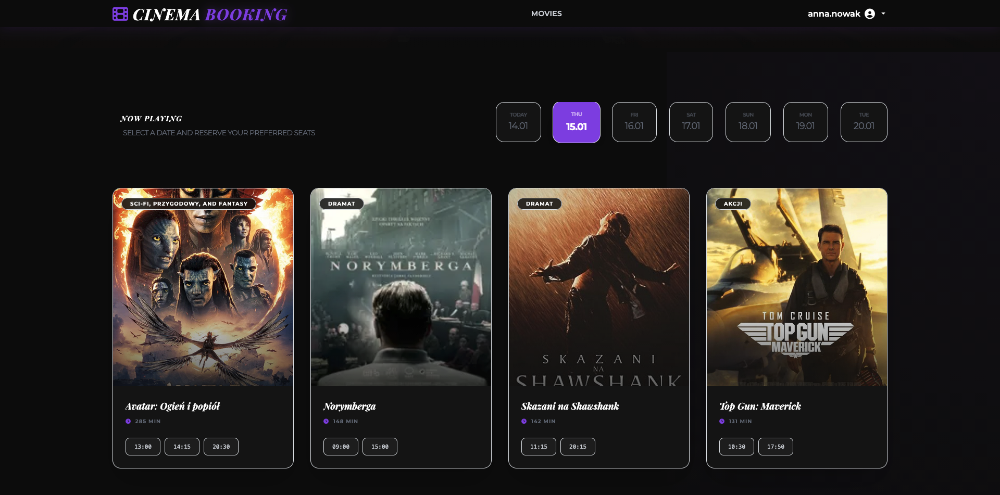

Movies overwiev
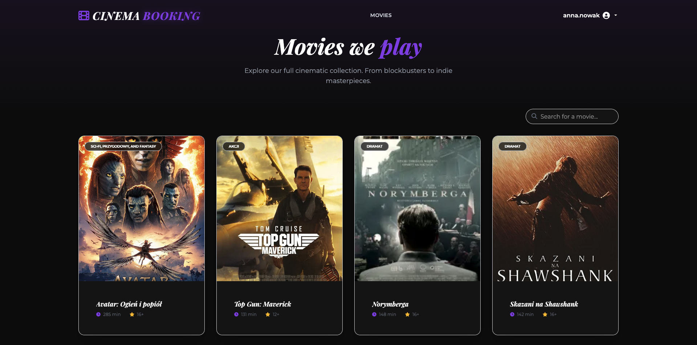

Interactive Seat Selection

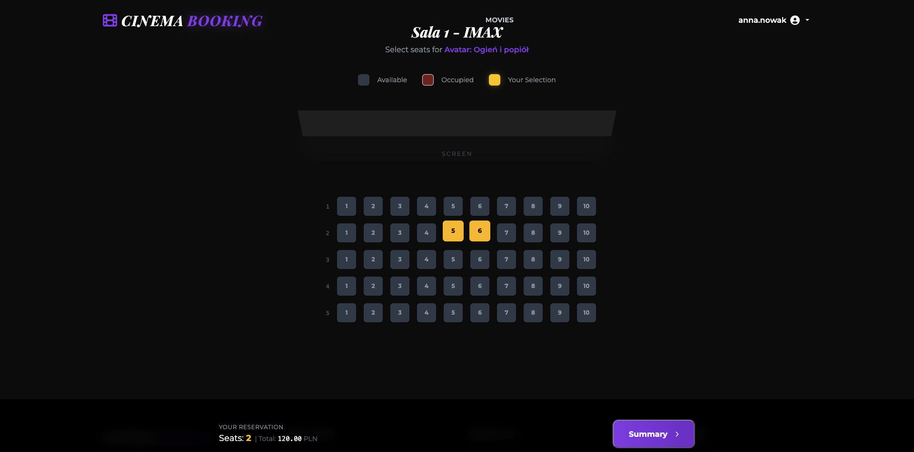

Reservation Overview

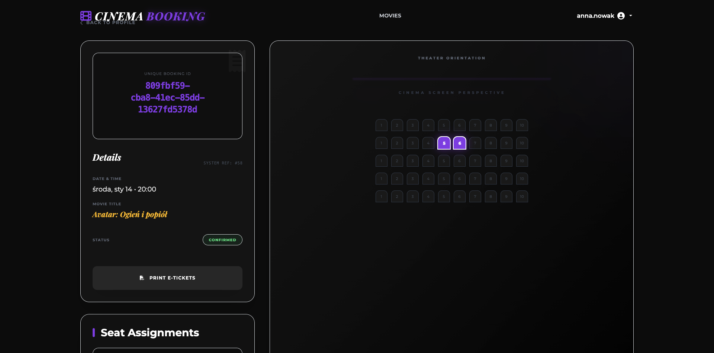

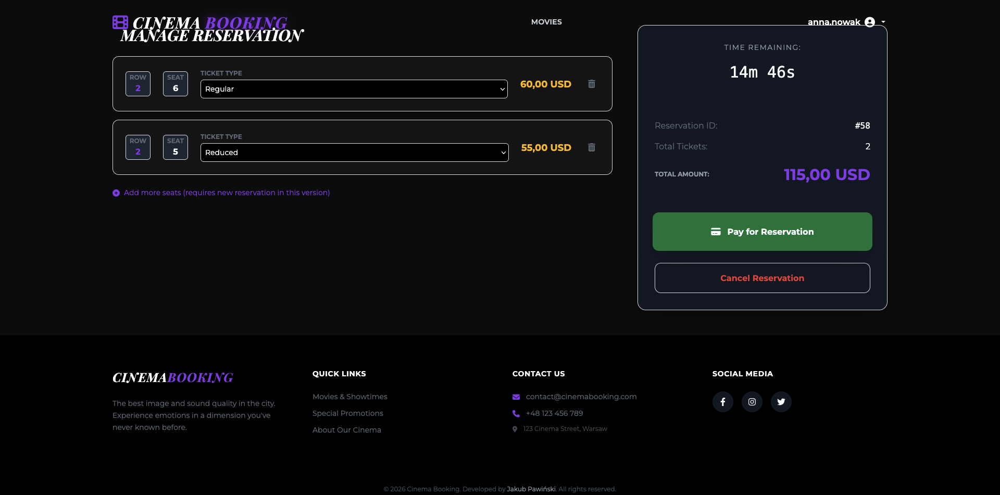

Booking History

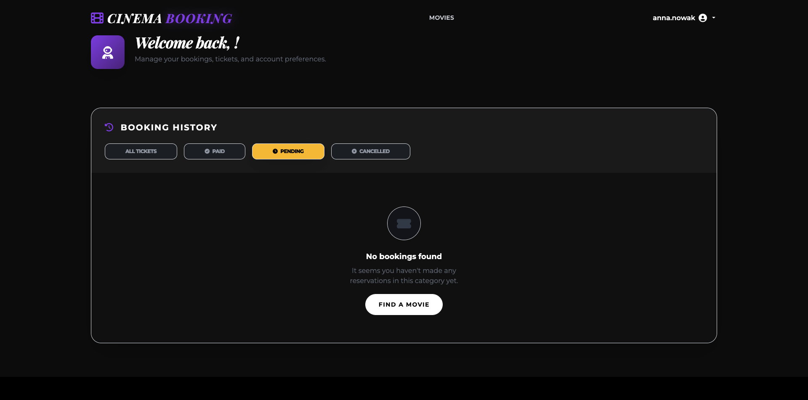

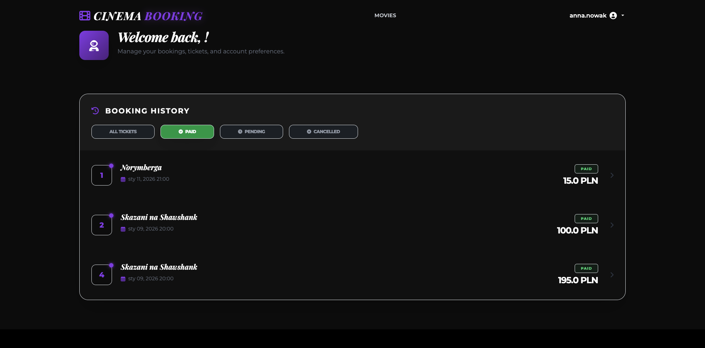

Admin Panel

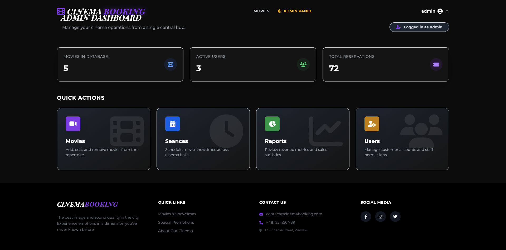

Movie Management

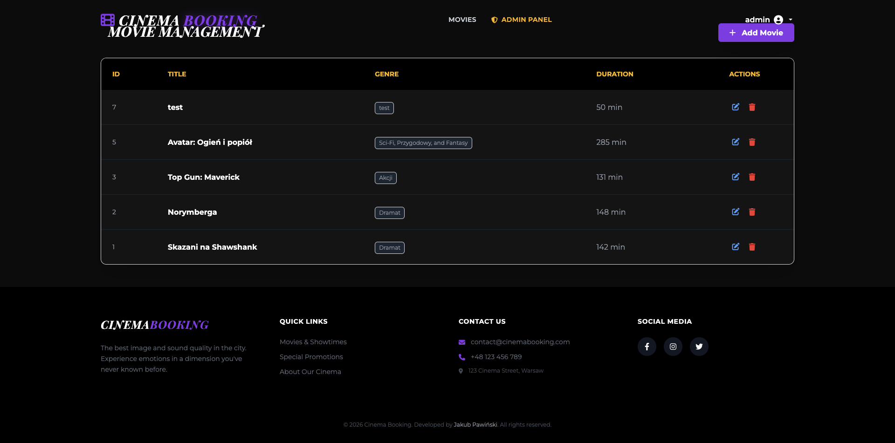

Seance Management

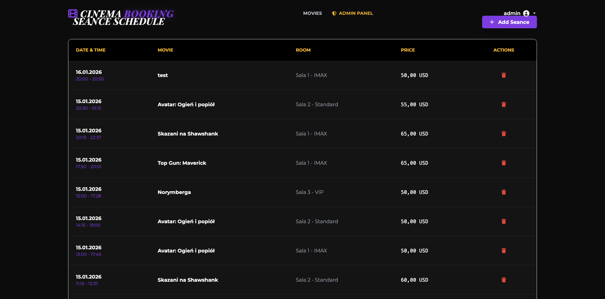

Reports

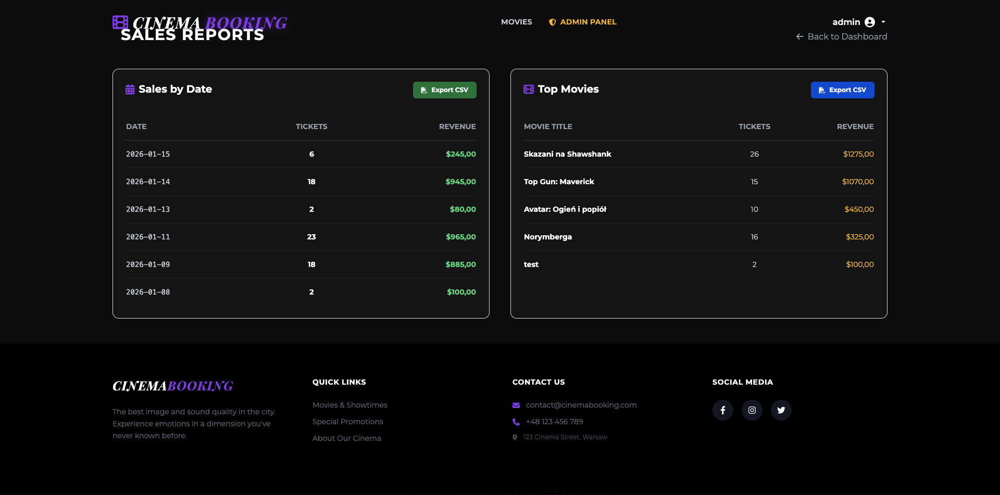


---

Author: Jakub Pawiński